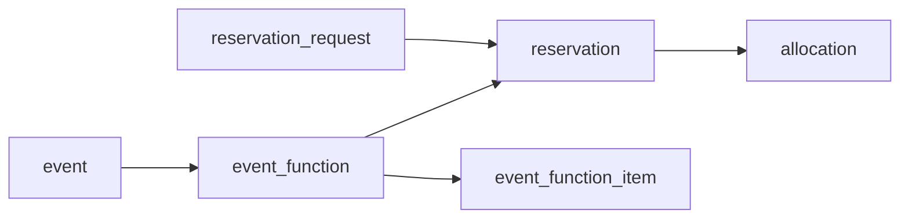

# Implementacijska specifikacija — ispravak Faze 2 i Faza 3 (event management)

Migracije **V95** (ispravak Faze 2) i **V96–V99** (Faza 3). Paketi su Faza 4 (`faza-4-spec.md`).

Temeljno pravilo: ništa što već postoji ne dobiva drugu kopiju. Prostor je `resource`, kapacitet ide isključivo kroz `reservation` → `allocation`.

## Stanje implementacije (odstupanja od nacrta niže)

Implementirano i pokriveno testovima (JUnit + Playwright `e2e/crm-flow.spec.ts`). Gdje se nacrt niže razlikuje, vrijedi ovo:

- **V95** prije brisanja `function_space*` kopira eventualne podatke (površina, kat, svjetlo, setupi) na `resource` / `resource_setup_capacity`.
- **V97** parcijalni unique indeks je `uq_reservation_active_event_function ... where event_function_id is not null and upper(status) <> 'CANCELLED'` — otpuštena linija ne blokira novu za istu funkciju. Check se zove `reservation_owner_check`.
- **Prijelazi**: dodan `TENTATIVE → INQUIRY` (povlačenje opcije, otpušta holdove). TENTATIVE i DEFINITE traže **barem jednu** funkciju s prostorom; funkcija bez prostora (npr. coffee break u foajeu) ne drži ništa — nije uvjet da *sve* funkcije imaju prostor. Zatvaranje (TURNED_DOWN / LOST / CANCELLED) traži `OPPORTUNITY_CLOSE`.
- **Istek opcije** nije poseban job nego `EventService.expireTentativeOptions` (`@Scheduled`), svaka stavka u vlastitoj transakciji (`TransactionTemplate`). Hold sam istječe kroz `allocation.expires_at` (kraj `decision_date` + 1 dan u 00:00, zona servera); job samo prebacuje event u LOST.
- **Cijena najma**: `ReservationPricingService` nije izvučen. `ReservationService.holdEventFunctionLine` ima vlastiti `applyEventLinePricing` (default uom proizvoda resursa, `PriceListEntryResolver` s `INTERNAL`, `selectPriceEntry`; bez cijene → 400). Postojeći put rezervacija nije diran osim izdvajanja `buildHoldAllocations`.
- **Qty najma** (`deriveEventLineQty`): MINUTE → minute, HOUR → zaokruženo naviše, DAY / HALF_DAY → broj kalendarskih dana, ostalo → 1.
- **V98** `qty` je `integer` (stavka računa ima cijeli broj količine).
- **V99** status je `ISSUED / SUPERSEDED` (nova verzija prethodnu označi SUPERSEDED), bez `pdf_object_key`: PDF se renderira na zahtjev iz snapshota (openhtmltopdf), ništa se ne pohranjuje.
- **Račun**: `invoiceService.createManualDraft` + `reference_table = 'event'`; postojeći DRAFT za event se ponovno koristi. Najam ulazi samo kad je cijena > 0.
- **Prava**: `EVENT_READ` / `EVENT_WRITE` (SALES_REP, SALES_MANAGER, EVENT_COORDINATOR oba; REVENUE_MANAGER read).
- **Admin**: lead/opportunity `attrs` su samo intake (dijalog *Edit inquiry*, popis *Spaces that fit* je informativan). Rute `/events`, `/events/:id`, `/spaces`, `/packages`. Space grid je tjedni pogled (dani × prostori), kompozicija se prikazuje i na roditelju i na članovima.
- **Dev seed** `scripts/dev/seed-events.sql` (tenant 2 po defaultu, `-v tenant=N`): profil *Events EUR* 2026–2027, `booking_calendar` 07:00–23:00 grid 30.

## Event nije `reservation_request`

Plan je to odbacio, a kod potvrđuje:

- `applyPricingForHoldReservation` za `INTERNAL` briše valutu, uom, qty, cijenu i iznos — najam dvorane bi ostao bez cijene
- `INTERNAL` + `DRAFT` je open-ended (`isOpenEndedDraftRequest`): `expires_at` se prisilno drži na null, pa tentative opcija ne bi mogla isteći
- `finalizeRequest` dodjeljuje confirmation code, portal token gosta, šalje email gostu (`ReservationConfirmationEmailListener`) i veže Opera rezervaciju
- status mašina `DRAFT → PENDING_PAYMENT → CHECKED_IN → CHECKED_OUT` nije `TENTATIVE → DEFINITE → ACTUAL`

Zato je `event` vlastiti header, a `event_function` generira `reservation` s `request_id = null` i `event_function_id` postavljenim.



Provjereno u kodu:

- `reservation.request_id` je nullable od V19; `ReservationService` (612), `ReservationAmendmentService` (196) i `ReservationRequestDtoMapper` (67) već null-provjeravaju
- `ReservationController` (42, 69) traži request — event linije ne idu kroz taj kontroler nego kroz `EventService`
- izvještaji s inner `join r.request` (`ManagementForecastRepository`, `ManagementStayDashboardRepository`, `ReservationRepository`) linije eventa preskaču — željeno
- `ReservationRequestExportService:290` radi samo nad rezervacijama konkretnog requesta
- `invoice` ima generički `reference_table` / `reference_id` i nullable `reservation_request_id`

## Korak 0 — vraćanje UI duplikata (booking-admin)

- **opportunity**: uklanjaju se tab *Event & Catering* (uređivanje `attrs`) i tab *Proposal* (`attrs.lines`, "Use as deal value"). Na njihovo mjesto panel *Events* s gumbom *Create event*.
- **lead**: `attrs` ostaje lagani intake — `inquiryType`, `eventType`, `startDate`, `endDate`, `pax`, `setupStyle`, slobodne želje. Catering i usluge su želje klijenta, ne stavke s cijenom.
- konverzija lead → opportunity i dalje kopira intake; opportunity ga prikazuje read-only, a *Create event* njime predpopunjava header eventa.
- briše se `ProposalLine`, `LINE_CATEGORIES`, `lineTotal`, `linesTotal` i `ProposalEditor.tsx`.

## Korak 1 — V95: ispravak Faze 2 (prostori)

`function_space` duplicira `resource` (`active`), `resource_composition` (`divisible`) i `booking_calendar` (`min_duration_minutes`). Obje tablice su prazne.

```sql
alter table resource add column area_sqm numeric(8,2);
alter table resource add column floor text;
alter table resource add column natural_light boolean;

create table resource_setup_capacity (
  id bigserial primary key,
  tenant_id bigint not null,
  resource_id bigint not null references resource(id) on delete cascade,
  setup_style text not null check (setup_style in
    ('THEATRE','CLASSROOM','U_SHAPE','BOARDROOM','BANQUET','CABARET','RECEPTION','HOLLOW_SQUARE')),
  capacity integer not null check (capacity > 0),
  notes text,
  created_at timestamptz not null default now(),
  unique (resource_id, setup_style)
);
create index idx_resource_setup_capacity_tenant on resource_setup_capacity (tenant_id);

drop table function_space_setup;
drop table function_space;
```

- entitet `ResourceSetupCapacity`, enum `SetupStyle` ugniježđen u njemu
- resurs mora biti tenantov i tipa `MEETING_ROOM` / `MEETING_OFFICE` / `COMPOSITION`
- `GET/PUT /api/resources/{id}/setup-capacities` (PUT zamjenjuje cijeli set)
- `GET /api/crm/spaces?minPax=&setupStyle=&from=&to=` — kandidati po kapacitetu, slobodan termin kroz `AvailabilityService`
- brišu se `FunctionSpace*` klase i admin `functionSpaces.ts`; *Function Spaces* u adminu postaje filtrirani pogled na resurse s tabom *Setups*
- najam: `resource.product` + `price_list` (HOUR / HALF_DAY / DAY kao podatak); pregradivost: `resource_composition`; radno vrijeme i trajanje: `booking_calendar`

## Korak 2 — V96: event i status

```sql
create table event (
  id bigserial primary key,
  tenant_id bigint not null,
  account_id bigint not null references crm_account(id) on delete restrict,
  primary_contact_id bigint references crm_contact(id) on delete set null,
  opportunity_id bigint references crm_opportunity(id) on delete set null,
  name text not null,
  status text not null default 'INQUIRY' check (status in
    ('INQUIRY','TENTATIVE','DEFINITE','ACTUAL','TURNED_DOWN','LOST','CANCELLED')),
  decision_date date,
  date_from date not null,
  date_to date not null,
  expected_pax integer check (expected_pax >= 0),
  guaranteed_pax integer check (guaranteed_pax >= 0),
  guarantee_due_date date,
  actual_pax integer check (actual_pax >= 0),
  currency text not null default 'EUR',
  owner_user_id bigint not null,
  outcome_reason_id bigint references crm_outcome_reason(id) on delete set null,
  notes text,
  attrs jsonb not null default '{}'::jsonb,
  created_at timestamptz not null default now(),
  updated_at timestamptz,
  created_by bigint,
  updated_by bigint,
  check (date_to >= date_from)
);

create table event_status_history (
  id bigserial primary key,
  tenant_id bigint not null,
  event_id bigint not null references event(id) on delete cascade,
  from_status text,
  to_status text not null,
  outcome_reason_id bigint references crm_outcome_reason(id) on delete set null,
  note text,
  changed_by bigint,
  created_at timestamptz not null default now()
);
```

(+ indeksi na svaki FK, `tenant_id`, i `(tenant_id, status)`.)

Prijelazi (sve ostalo → 409):

| Iz | U | Uvjet |
|---|---|---|
| INQUIRY | TENTATIVE | `decision_date` ≥ danas, sve funkcije imaju prostor |
| TENTATIVE | DEFINITE | |
| DEFINITE | ACTUAL | `actual_pax` postavljen, `date_to` prošao |
| INQUIRY | TURNED_DOWN | razlog kind `TURNED_DOWN` |
| INQUIRY, TENTATIVE | LOST | razlog kind `LOST` |
| DEFINITE | CANCELLED | razlog kind `CANCELLED` |

Svaki prijelaz piše `event_status_history`. `guaranteed_pax` se nakon `guarantee_due_date` ne smije smanjiti (409).

## Korak 3 — V97: funkcije i veza na `reservation`

```sql
create table event_function (
  id bigserial primary key,
  tenant_id bigint not null,
  event_id bigint not null references event(id) on delete cascade,
  resource_id bigint references resource(id) on delete restrict,
  function_type text not null check (function_type in
    ('PLENARY','BREAKOUT','COFFEE_BREAK','LUNCH','DINNER','RECEPTION','EXHIBITION','OTHER')),
  setup_style text,
  starts_at timestamp not null,
  ends_at timestamp not null,
  occupancy_starts_at timestamp not null,
  occupancy_ends_at timestamp not null,
  pax integer check (pax >= 0),
  package_product_id bigint references product(id) on delete set null,
  notes text,
  display_order integer not null default 0,
  created_at timestamptz not null default now(),
  check (ends_at > starts_at),
  check (occupancy_starts_at <= starts_at and occupancy_ends_at >= ends_at)
);

alter table reservation add column event_function_id bigint
  references event_function(id) on delete restrict;
create unique index ux_reservation_event_function
  on reservation (event_function_id) where event_function_id is not null;

-- prije checka: padni glasno ako postoje rezervacije bez requesta
do $$
begin
  if exists (select 1 from reservation where request_id is null) then
    raise exception 'reservation rows without request_id exist; resolve before V97';
  end if;
end $$;

alter table reservation add constraint ck_reservation_owner
  check ((request_id is null) <> (event_function_id is null));
```

`package_product_id` ostaje nullable bez logike do Faze 4.

**Mapiranje statusa na kapacitet** (`EventReservationSync`):

| Event | `reservation` linija funkcije | `allocation` |
|---|---|---|
| INQUIRY | ne postoji | — |
| TENTATIVE | kreira se za occupancy prozor | `HOLD`, `expires_at` = kraj `decision_date` u zoni tenanta |
| DEFINITE | `CONFIRMED`, `expires_at` null | `CONFIRMED` |
| TURNED_DOWN / LOST / CANCELLED | `CANCELLED` | brišu se kao kod postojećeg otkaza |

- linija: `request_id` null, `event_function_id`, `request_type = INTERNAL`, `adults/children/infants = 0`, `requested_resource = resource_id`, `product_id = resource.product`
- `ReservationService` dobiva internu metodu `holdForEventFunction(...)` koja koristi postojeći put do `allocation` (composite, `ensureAvailability`, `buildAllocation`) — konflikt termina je 409 iz postojećeg puta
- **cijena najma** se ne uzima iz `applyPricingForHoldReservation` (on za `INTERNAL` briše cijenu). Iz `ReservationService` se izvlači `ReservationPricingService` (resolve product, uom, `PriceListEntryResolver`, `selectPriceEntry`, `deriveReservationQty`) i zovu ga oba puta; event linija ga zove s `requestType = INTERNAL` samo za odabir cjenovnog profila
- izmjena prostora ili occupancy prozora u TENTATIVE/DEFINITE: stara linija i alokacije se otpuštaju, nova se kreira u istoj transakciji
- brisanje funkcije s linijom u DEFINITE → 409; u TENTATIVE otpušta liniju
- `pax` > `resource_setup_capacity.capacity` za njezin setup → 400; prostor bez tog setupa → 400
- **istek opcije**: `EventOptionExpiryJob` (`@Scheduled`, po uzoru na `expireStaleRequests`) — TENTATIVE event s isteklim `decision_date` ide u LOST s razlogom `OPTION_EXPIRED` (kind `LOST`; `crm_outcome_reason` je po tenantu, servis ga kreira pri prvoj upotrebi) i otpušta linije
- postojeći `PaymentService`/request jobovi linije eventa ne vide jer nemaju request

## Korak 4 — V98: stavke funkcije

```sql
create table event_function_item (
  id bigserial primary key,
  tenant_id bigint not null,
  event_function_id bigint not null references event_function(id) on delete cascade,
  product_id bigint not null references product(id) on delete restrict,
  package_product_id bigint references product(id) on delete set null,
  uom text not null,
  qty numeric(10,2) not null check (qty > 0),
  qty_basis text not null check (qty_basis in ('FIXED','PER_GUARANTEED_PAX')),
  serve_at timestamp,
  unit_price numeric(12,2) not null,
  discount_amount numeric(12,2) not null default 0,
  gross_amount numeric(12,2) not null,
  cost_amount numeric(12,2),
  dietary_notes text,
  allergens text[],
  display_order integer not null default 0,
  created_at timestamptz not null default now()
);
```

- coffee break u 10:30 je stavka plenarne funkcije 09:00–17:00 sa `serve_at`, ne zasebna funkcija; `serve_at` mora biti unutar `starts_at`–`ends_at` funkcije (400)
- `unit_price` je snapshot iz `price_list` (`PriceListEntryResolver`, datum funkcije, `INTERNAL`) pri dodavanju, ručno promjenjiv; `uom` je podatak iz `product.default_uom` / `extra_uoms`
- `PER_GUARANTEED_PAX`: qty = `expected_pax` dok nema `guaranteed_pax`, zatim `guaranteed_pax`, a nakon ACTUAL `max(guaranteed_pax, actual_pax)`; preračun u servisu pri promjeni brojki, `gross_amount = qty × unit_price − discount_amount`
- stavke ne zauzimaju kapacitet
- `GET /api/events/{id}/financials` — read model: najam (iz linija), stavke po funkciji i kategoriji proizvoda, ukupno, trošak, marža; ništa se ne pohranjuje

## Korak 5 — V99: BEO i račun

```sql
create table event_order (
  id bigserial primary key,
  tenant_id bigint not null,
  event_id bigint not null references event(id) on delete cascade,
  version integer not null,
  status text not null default 'DRAFT' check (status in ('DRAFT','ISSUED')),
  snapshot jsonb not null,
  pdf_object_key text,
  issued_at timestamptz,
  issued_by bigint,
  created_at timestamptz not null default now(),
  unique (event_id, version)
);
```

- izdavanje BEO-a: snapshot funkcija i stavki, PDF preko postojećeg PDF servisa u MinIO, nova verzija pri svakom izdavanju; izdavanje traži TENTATIVE ili DEFINITE
- **račun**: `InvoiceService.createDraftForEvent(eventId)` po uzoru na `createManualDraft`, s `reference_table = 'event'`, `reference_id = event.id`, `reservation_request_id` null; linije = najam iz linija funkcija + stavke, PDV iz proizvoda. Traži DEFINITE ili ACTUAL. Rate i depoziti su Faza 5 (`sales_payment_milestone`).

## API

- `GET/POST /api/events`, `GET/PUT /api/events/{id}`, `PUT /api/events/{id}/status`, `GET /api/events/{id}/history`
- `POST /api/crm/opportunities/{id}/events` — kreira event iz opportunityja (account, kontakt, intake)
- `GET/POST /api/events/{id}/functions`, `PUT/DELETE /api/events/functions/{id}`
- `GET/POST /api/events/functions/{id}/items`, `PUT/DELETE /api/events/items/{id}`
- `GET /api/events/{id}/financials`, `GET /api/events/space-grid?from=&to=&locationId=`
- `GET/POST /api/events/{id}/orders`, `GET /api/events/orders/{id}/pdf`, `POST /api/events/{id}/invoice`

Svi upiti filtriraju po `TenantResolver.requireTenantId()`.

## Korak 6 — booking-admin

- **Event stranica**: header (status s prijelazima, decision date, tri brojke pax), tabovi *Functions*, *Catering & items*, *Financials*, *BEO*, *History*
- **Functions**: timeline po dvorani i danu nad `space-grid` (mockup "Function Room Availability"); dodavanje funkcije nudi prostore filtrirane po pax i setupu
- **Catering & items**: stavke po funkciji iz kataloga proizvoda, sa `serve_at`
- **Events lista**: filtri po statusu, datumu, accountu
- **opportunity**: panel *Events* + *Create event*
- **Spaces**: resurs-editor s površinom, katom, svjetlom i tabom *Setups*

## Dev podaci

`scripts/dev/seed-events.sql` (ne migracija): Main Hall kao COMPOSITION od Hall A + Hall B, Boardroom, Breakout 1; setupi; proizvodi za najam s HOUR / HALF_DAY / DAY cijenama; `booking_calendar` 08:00–22:00 grid 30; catering proizvodi (coffee break, ručak, večera, voda).

## Testovi

JUnit 5 + Mockito bez baze: prijelazi statusa i razlozi, mapiranje status → reservation/allocation, cijena najma kroz izvučeni pricing servis, kapacitet po setupu, `serve_at` unutar funkcije, qty po pax bazi, istek opcije, račun eventa. Postojeći `ReservationService` testovi moraju proći nepromijenjeni nakon izvlačenja pricing servisa. E2E: opportunity → event → funkcije → stavke → TENTATIVE → DEFINITE → BEO.

## Svjesno izvan ove faze

- paketi — Faza 4
- quote, ugovor, rate — Faza 5
- first / second option, kapacitet kuhinje, smještaj i rooming liste
